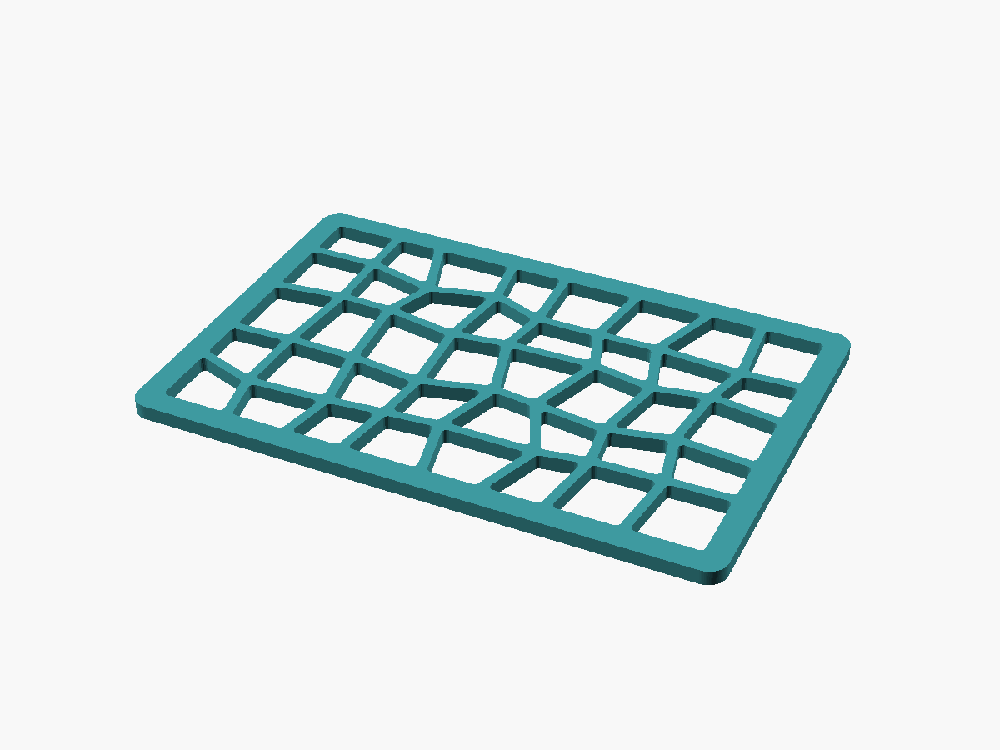
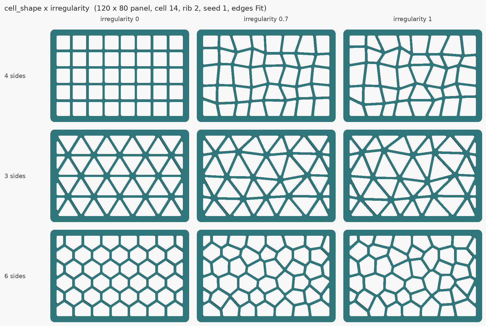
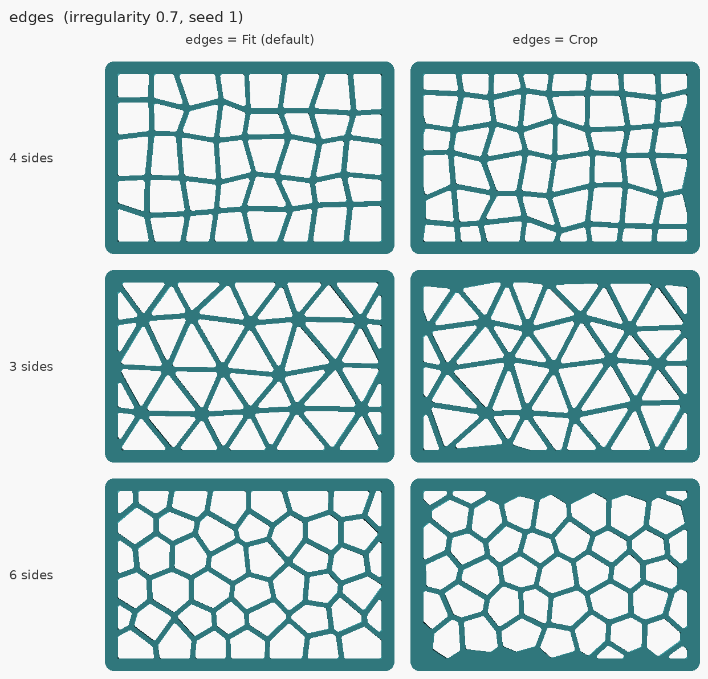

# LEOPARD VENT — irregular-cell venting and lightening pattern

A field of uneven polygon holes separated by ribs of one set thickness. The
look borrows from leopard print — scattered spots of differing size and shape —
but each spot is simplified to a straight-sided cell: **four sides** by default,
three for a triangle web, or six for uneven Voronoi cells.



Use it three ways:

1. **Standalone** — open [`src/leopard_vent.scad`](../src/leopard_vent.scad) in
   OpenSCAD or MakerWorld's Parametric Model Maker and generate a vented panel,
   a cutter body for a slicer or CAD subtract, or a flat 2D outline for DXF/SVG.
2. **As a library** — `use <leopard_vent.scad>` and subtract `leopard_vent_2d()`
   from your own part. See [Using it in your own part](#using-it-in-your-own-part).
3. **In Onshape** — [`featurescript/leopard_vent.fs`](../featurescript/leopard_vent.fs)
   is the same pattern as a custom feature: pick planar faces and it cuts them.
   Its geometry is tested; it has **not yet been run inside Onshape**. See
   [featurescript.md](featurescript.md).

## The rib thickness is a guarantee

The cells tile the plane edge to edge — every edge is shared by exactly two
cells — and each cell is shrunk inward by half a rib. Wherever two holes face
each other, the web between them is therefore exactly one rib thick. At corners
and junctions, where three or more holes meet, the web only comes out thicker.
Rounding the hole corners and dropping small holes both only ever *remove*
hole, so neither can thin a rib either. The border works the same way.

That is the argument. The evidence is that every exported mesh in the
validation matrix, and 600 further seed-sweep renders, were sectioned and
measured by [`tools/ribcheck.py`](../../../tools/ribcheck.py): the thinnest web
between any two holes and the closest any hole comes to the edge. Not one came
in under the requested value beyond the STL file format's own 0.001 mm rounding.
See [validation.md](validation.md).

## Controls

### Part
| Control | Default | Range | What it does |
| --- | --- | --- | --- |
| `panel_shape` | Rectangle | Rectangle / Circle | Circle uses `panel_width` as the diameter. |
| `panel_width` | 120 mm | 30–250 | Width, or diameter. |
| `panel_height` | 80 mm | 30–250 | Ignored for a circle. |
| `thickness` | 3.0 mm | 1–12 | Panel thickness. |
| `panel_corner_radius` | 4 mm | 0–30 | Outside corner rounding. Clamped to half the short side. |
| `border` | 5 mm | 1–30 | Solid band round the edge. **Raised to the rib thickness if set below it.** |

### Pattern
| Control | Default | Range | What it does |
| --- | --- | --- | --- |
| `cell_shape` | 4 sides | 3 / 4 / 6 sides | See [Cell shapes](#cell-shapes). |
| `cell_size` | 14 mm | 5–60 | Average cell width. Every shape is scaled so a cell has about the area of a square this wide, so switching shape keeps the hole count about the same. |
| `rib_thickness` | 2.0 mm | 0.8–10 | The web between neighbouring holes — the guaranteed minimum. 0.8 mm is two 0.4 mm extrusion widths, the least that prints as a wall. |
| `irregularity` | 0.7 | 0–1 | 0 is a perfectly regular square grid / triangle web / honeycomb. 1 is as uneven as the cells can go while staying valid. |
| `hole_corner_radius` | 1.0 mm | 0.5–8 | Rounds every hole corner: cleaner prints, and no sharp stress raiser in the rib. **Large values erase the smaller cells** — see below. |
| `min_hole` | 4 mm | 0–20 | A hole that cannot hold a circle this wide is left solid. Mainly clears slivers in Crop mode. |
| `seed` | 1 | 1–999 | Which arrangement. Same seed, same pattern, every time. |
| `edges` | Fit | Fit / Crop | See [Edges](#edges-fit-or-crop). A circle is always cropped. |

### Holes
| Control | Default | Range | What it does |
| --- | --- | --- | --- |
| `hole_type` | Through | Through / Pocket | Through for venting. Pocket keeps a closed floor, for lightening a part that must still seal or carry a face. |
| `floor_thickness` | 1.0 mm | 0.4–6 | Floor under each pocket. Must leave at least 0.4 mm of pocket, or the render is refused. |

### Output
| Control | Default | What it gives you |
| --- | --- | --- |
| `output` = Panel | ✓ | The finished part. |
| `output` = Cutter | | Only the hole bodies, one per hole, lined up with the panel the same settings would make. Load it as a **negative part / negative volume** in a slicer that supports one (PrusaSlicer, Bambu Studio, OrcaSlicer), or subtract it in CAD. Through holes overshoot both faces by 1 mm; pockets start at the floor. |
| `output` = 2D holes | | A flat outline of the holes for **File → Export → DXF or SVG** in desktop OpenSCAD. It has no 3D body, so STL export — and therefore MakerWorld — cannot use it. OpenSCAD writes DXF as loose `LINE` segments, not polylines; most CAD imports join them, but if yours shows hundreds of separate lines, use the SVG. |

## Cell shapes



- **4 sides** — a jittered grid of quads. What you asked for; reads as cracked
  tile or giraffe more than leopard at high irregularity.
- **3 sides** — a jittered triangle web. Triangulated like an aerospace
  isogrid, so it resists in-plane shear by bracing rather than by bending the
  ribs. That is standard truss reasoning; it has **not** been load-tested here.
- **6 sides** — uneven Voronoi cells; at irregularity 0 a regular honeycomb.
  The closest to real leopard print. Some edges are short enough that the corner
  rounding swallows them, so many cells *read* as five-sided. Counted over ten
  seeds: at irregularity 0.7 and below every inner cell really is a hexagon; at
  1, about one in five has five or seven sides.

## Edges: Fit or Crop



**Fit** (default for rectangles) builds the cells to fill the panel exactly.
The lattice is stretched slightly so a whole number of cells spans it, corners on
the edge slide only along the edge, and every edge hole is a whole cell with
one straight side exactly one border-width in. The stretch is at most half a
cell spread across a row — about 8 % with 6 cells across, less with more.

**Crop** grows the pattern past the panel and cuts it off, like fabric. It looks
more random, but edge holes are fragments of cells, and fragments narrower than
`min_hole` are filled — which leaves visible solid patches along the border. In
one early test, a 160 mm panel with 8 mm cells lost an entire ring of edge
fragments and the measured border came out at 7.4 mm instead of 5. Fit was added
because of that.

Crop is the only option for a circle, and for any non-rectangular region passed
to the library. In Crop mode the pattern is anchored at the centre: a bigger
panel shows more of the same pattern round the middle, it does not reshuffle.
(Verified — every central hole of a 120×80 panel reappears unchanged in a 200×150
one, for all three shapes.)

## Things that will surprise you

- **Big corner radii erase holes.** A hole narrower than twice the corner radius
  cannot be rounded and is left solid. At 8 mm on the default panel, 5 of 40
  holes disappear and open area drops from 61 % to 47 %. The slider is clamped
  to 0.4 of the nominal hole width, and the console says when it bites; that
  limits the damage, it does not prevent it.
- **The largest hole is bigger than the nominal one.** Jitter enlarges some
  cells. On the default panel the nominal hole is 12 mm and the largest measured
  is 13.4 mm; at irregularity 1 with 6 sides, 15.1 mm. If hole size matters —
  finger safety, insect mesh, a screw that must not fall through — run
  `ribcheck.py` on your export and read `largest`, rather than trusting the
  nominal figure.
- **Fitted cells are not exactly `cell_size`.** See Edges above.
- **`min_hole` and the corner radius are clamped** to 0.8 and 0.4 of the nominal
  hole width. Both print a console note when they are.
- **Refused, with a console message saying why:** a rib under 0.8 mm; a rib that
  leaves holes under 2 mm wide; a border that leaves no room for holes; pockets
  under 0.4 mm deep.

## Measured numbers

From the validation matrix (120 × 80 × 3 mm panel unless noted). Open area is
hole area over panel area, measured on the exported mesh.

| Case | Holes | Open area | Smallest / largest hole |
| --- | --- | --- | --- |
| Default (4 sides, 0.7, rib 2) | 40 | 61.4 % | 8.7 / 13.4 mm |
| 3 sides | 44 | 56.9 % | 5.0 / 12.0 mm |
| 6 sides | 45 | 61.1 % | 5.5 / 14.4 mm |
| Default, rib 0.8 | 40 | 72.2 % | 9.7 / 14.4 mm |
| Default, Crop | 48 | 58.7 % | 5.4 / 13.0 mm |
| 250 × 250, 3 sides, cell 5, rib 0.8 | 1771 | 45.3 % | 2.9 / 5.2 mm |

Through-hole weight saving equals the open area: the default panel is 11.1 cm³
against about 28.7 cm³ solid. Filament and print time are **not** measured —
slice it.

**Render time** is a non-issue for the panel: every case is built from 2D
booleans and one extrusion, never a 3D difference. The default takes about
0.1 s; 1771 holes take about 2 s; the slowest case in the matrix is a large
pocketed panel at 9–10 s, because pockets need one 3D union. These were single measurements
on a shared container and are worth about one significant figure.

## Printing

| | |
| --- | --- |
| Orientation | Flat, as exported. Pockets open upward, floor on the bed. |
| Supports | None. Every wall is vertical. |
| Ribs | 0.8 mm prints as exactly two 0.4 mm lines and leaves no room for error; 1.2–2 mm is the comfortable range. Match the rib to a whole number of extrusion widths if your slicer leaves gap-fill in thin walls. |
| Small holes | Below about 3 mm, holes in a 3 mm plate tend to come out undersized; that is what `min_hole` is for. |

## Using it in your own part

`use <leopard_vent.scad>` imports the module without any of the standalone
part. The module takes the region as its child, and needs `bounds` because
OpenSCAD cannot measure geometry:

```openscad
use <leopard_vent.scad>

// 80 x 50 vent through a 2.5 mm lid, kept 4 mm off the lid edge.
// No child: the bounds box is the region, and the cells are fitted to it.
difference() {
    my_box();
    translate([10, 10, lid_z - 1])
        linear_extrude(height = 2.5 + 2)
            leopard_vent_2d(bounds = [[0, 0], [80, 50]],
                            cell_size = 10, rib = 1.6, border = 4);
}

// Any 2D shape can be the region, holes in it included -- pass it as a child.
// With a child the pattern is cropped, since only a rectangle can be fitted.
leopard_vent_2d(bounds = [[-30, -30], [30, 30]], shape = "6 sides")
    circle(d = 60);
```

All parameters: `bounds`, `cell_size`, `rib`, `shape`, `irregularity`,
`corner_radius`, `min_hole`, `seed`, `border`, `fit`. They mean the same as the
customizer controls above; `fit` defaults to true with no child and false with
one.

The 3D `difference()` above works, but it is CGAL and costs time: measured at
1.2 s against 0.1 s for 47 holes, and 8.8 s against 0.4 s for 310. If your part
is a flat extrusion, subtract in 2D before extruding, as the standalone panel
does.

[`examples/fan_grille.scad`](../examples/fan_grille.scad) is a worked example:
a fan grille for 40–140 mm fans, whose vent region is a ring — the blade circle
with a solid disc left over the motor hub. The screw spacings in it are the
common figures, **not** checked against a real fan.


## Testing status

**CAD-validated. Nothing has been printed.**

- 47/47 parameter matrix and 39/39 measured-web checks on the standalone file;
  10/10 and 9/9 on the fan grille example. See [validation.md](validation.md).
- 600 more renders sweeping 40 seeds × 3 shapes at full irregularity, on
  default, odd-sized, thin-strip and small-cell circular panels. All watertight,
  one body, rib and border never under the requested value.

Unverified: print quality of thin ribs, stiffness or strength of any pattern,
airflow, the fan grille's fit.
