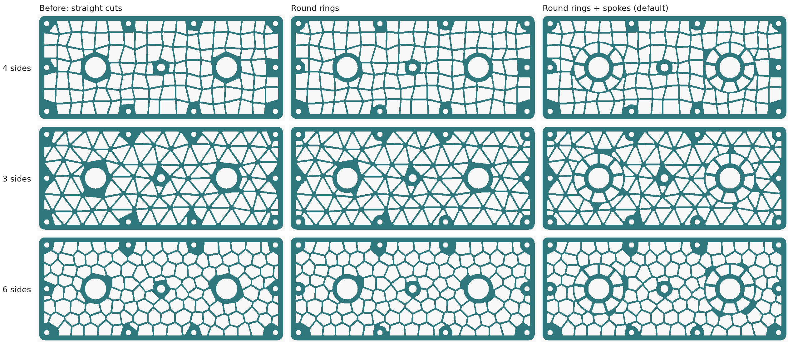

# LEOPARD VENT for Onshape — FeatureScript

The same venting / lightening pattern as the OpenSCAD generator, as an Onshape
custom feature: pick one or more planar faces, and it cuts irregular 3-, 4- or
6-sided holes into them with an exact rib between every pair. Round holes
already in the face — bolts, bearings — get a true round ring of material, and
by default a wheel of spokes that ties them into the web.

File: [`featurescript/leopard_vent.fs`](../featurescript/leopard_vent.fs)




*All rendered from `tools/fsmirror.py`, the Python mirror of the feature's
geometry — not screenshots from Onshape. See "What has and has not been
tested" below. The first plate is 260 × 110 mm with ten 5.1 mm bolt holes,
two 22 mm bearing bores and an 8 mm hole, all at default settings. The second
is modelled on a real FRC side plate, 630 × 420 mm with about 90 bolt holes,
a curved slot and several cutouts, with 6-sided 30 mm cells: on the left as
the previous version cut it, on the right as this one does.*

## Status — read this first

**The geometry is tested. The Onshape side has never been run end to end.** I
had no Onshape access while writing it. Here is what that means in practice:

- Every Onshape call it makes was checked by name and argument against the
  FeatureScript standard library source, version 2960 (May 2026).
- All the maths — cells, outline handling, clipping, round rings, wheels,
  rounding, the exact lines and arcs it sketches — was executed outside
  Onshape and measured. See below.
- **First paste into Onshape (3083) found one error, now fixed:** `box` is a
  reserved word in FeatureScript (its mutable-reference type, `new box(x)`),
  and the file used it as a variable name in three places. Onshape reported
  "mismatched input 'box' expecting ID". `tools/fsinterp.py` now rejects
  FeatureScript's reserved words, and it now also enforces type annotations
  (`x is number`, `returns map`) the way Onshape does at run time, so the
  crosscheck catches both kinds of mistake.
- **The round rings and wheels, and the handling of curved slots, are new
  since that paste**, and have not been run in Onshape at all. If the feature errors, the Feature Studio's error panel
  gives a line number; that plus the message is enough to fix it.

## Installing

1. In any Onshape document, create a **Feature Studio**.
2. Select everything in it and paste `leopard_vent.fs` over it — **the whole
   file**, about 2,100 lines, ending with `holeArea`. Copy it with GitHub's
   "Copy raw file" button or from the downloaded file, not from a preview
   that may cut it short (a short paste shows up as
   `missing TOP_SEMI at '<EOF>'`). The file's first two lines are the ones Onshape writes for a
   new Feature Studio (`FeatureScript 3083;` and an import of `common.fs`). If
   your Onshape writes a newer number, keep yours.
3. In a Part Studio, add the feature to the toolbar through **Custom
   features**, choosing the document and Feature Studio you used. It appears
   as **Leopard vent**.

Updating an existing Feature Studio: paste the new file over the old one.
Leopard vent features already in your Part Studios pick up the new options at their
defaults — round rings and spokes on — so any face with round holes in it
will change. Faces without round holes come out exactly as before. To get the
old straight cuts back, untick **Round rings around circular holes**.

## Controls

| Control | Default | What it does |
| --- | --- | --- |
| Faces | — | One or more planar faces of solid parts. Each gets its own pattern. |
| Cell shape | 4 sides | 4 sides: jittered grid. 3 sides: jittered triangle web. 6 sides: uneven Voronoi cells, closest to real leopard print. |
| Cell size | 14 mm | Average cell width. Every shape is scaled so a cell has about the area of a square this wide. |
| Rib thickness | 2 mm | The web between neighbouring holes — guaranteed minimum. Down to 0.1 mm is allowed for laser or CNC; for FDM, stay at 0.8 mm (two extrusion widths) or more. |
| Border | 5 mm | Solid band kept along every edge of the face, and round any hole in it that is not round (with round rings on). Raised to the rib thickness if set below it. |
| Irregularity | 0.7 | 0 is a regular grid, triangle web or honeycomb; 1 is as uneven as the cells can get while staying valid. |
| Hole corner radius | 1 mm | Rounds every hole corner, as true arcs. 0 leaves them sharp. |
| Smallest hole kept | 4 mm | A hole that cannot hold a circle this wide is left solid. |
| Seed | 1 | Which arrangement. |
| Fit cells to the face | on | Stretches the cells slightly so whole cells fill the face's bounding rectangle, with edge holes running straight along it. Off: the pattern runs past the face and is cut off at the border. |
| **Round rings around circular holes** | on | Every circular hole in the face gets a ring of material of constant width: the holes beside it have true arcs facing it. Off: one straight cut per hole, as in the first version. |
| Ring width | 5 mm | Width of that ring, from the edge of the circle. Raised to the rib thickness if set below it. A 5 mm ring round a 5.1 mm bolt hole leaves a 15 mm boss. |
| **Spokes from circular holes** | on | Gives each circular hole that is big enough, and has room, a wheel: its ring, then a ring of sector-shaped holes between straight spokes, then a hoop one rib wide that the ordinary cells meet. Off: just the ring. |
| Spokes only on holes from | 10 mm | Smallest hole diameter that gets a wheel. Smaller holes — bolt holes — just get their ring: a wheel round every bolt hole on a robot plate is what made the first version a mess of chopped-up spokes. 0 puts a wheel round every round hole that has room. |
| Spoke thickness | 3 mm | Guaranteed minimum. Raised to the rib thickness if set below it. |
| Spoke length | 10 mm | From the ring out to the hoop: how far the wheel reaches. |
| Spokes per hole (0 = auto) | 0 | Auto is about one spoke per cell size of circumference, halfway along the spokes, and never fewer than 3: 8 round a 14 mm hole, 9 round a 22 mm bearing at the defaults. |
| Spoke angle | 90° | Direction of the first spoke, measured from the pattern direction; the rest are spread evenly round. |
| Hole type | Through | Through the part, or a pocket of a set depth. **Through cuts everything of that part beneath each hole** — a boss or rib under the face gets cut too. Use Pocket to stop short of it. |
| Pocket depth | 2 mm | Pocket only. Measured from the face. |
| Pattern direction | — | Optional straight edge to align the pattern with. Left empty, it follows the face's longest straight edge — which is what lets a rectangular face be fitted exactly. |

When it finishes, the feature reports the hole count and open area (holes over
face area). It also says when the corner radius or smallest hole was limited.
As in the OpenSCAD version, those two are capped at 0.4 and 0.8 of the nominal
hole width, because past that whole cells start to vanish.

## How it handles the face outline

The OpenSCAD version crops the pattern with 2D booleans. Onshape has no
dependable way to shrink a face's outline by the border: offsetting a boundary
inward fails as soon as the border is bigger than one of the outline's
fillets. So the outline is handled in maths instead:

- Each boundary edge is sampled into chords, at most 0.005 mm off a curve,
  with the face kept on the left — so the outer loop runs one way, holes in
  the face the other, and the feature can tell them apart.
- Every hole starts as a convex polygon. It is clipped by the boundary chords
  near it, each moved in by the border (plus that 0.005 mm). That is **exact
  for a convex outline** — rectangles, rounded rectangles, circles.
- On an outline with **inside corners** (an L-shape, a notch), only chords
  facing the hole's centre are applied. Near the corner itself this trims
  holes a little more than strictly needed, never less: there is a solid
  block under the notch in the second picture.
- **Holes already in the face that are not round, and convex** (straight
  slots, rectangles, D-holes) are kept clear with one straight cut per hole,
  chosen from several candidate directions to keep the most of it. Exact
  alongside straight sides; conservative at a slot's rounded ends.
- **Holes that are not convex** (a curved slot, an L-shaped cutout) are split
  into triangles, and each pattern hole gets one straight cut per triangle
  near it. The triangles cover the hole exactly, so the border is kept, and
  the pattern follows the hole's real shape — including inside the curve of a
  curved slot. The first version cut against the hole's convex hull instead,
  which left the whole area inside a curved slot solid.

Then each hole's polygon is sketched as its edges pushed out by the corner
radius, joined by arcs of that radius. That is the exact rounded shape, not an
approximation. The arc and line endpoints are computed by the same expression,
so every loop closes exactly. All holes on a face go into one sketch, are
extruded together and subtracted in one boolean, and the sketch is deleted.

## Round holes: rings and wheels

**What counts as a round hole:** an inner loop of the face whose every edge
lies on one circle — a drilled or cut hole, whether Onshape stores it as one
edge or several. The circle's centre and radius come straight from the edge
definition, so the ring is exact, without the chord allowance. A slot is not
round: its ends are arcs of two different circles.

**The ring.** Each hole beside a circle is bitten by a disc about the circle's
centre: it loses everything within the ring width of the circle, and the edge
it gets there is a true arc, concentric with the circle, rounded into its
straight sides by the corner radius. It is built the same way as the corner
rounding — shrink the hole by the corner radius, take away the disc grown by
the same amount, grow it back — so the ring is exactly the width asked for
wherever a hole faces the circle, and only wider elsewhere.

**The wheel.** With spokes on, each circle gets, from the inside out:

1. its ring;
2. a ring of sector-shaped holes, separated by straight spokes running
   radially out from the circle — each sector is exact: two straight sides
   half a spoke off the spokes, an inner arc on the ring, an outer arc
   *spoke length* further out, and rounded corners;
3. a hoop one rib wide;
4. the ordinary cells, bitten round so they meet the hoop with true arcs.

So a load on the bolt or bearing goes straight out along the spokes into the
hoop, and from the hoop into the web all the way round, rather than relying on
whichever ribs of the pattern happen to touch the ring.

**Where it falls back, and to what.** All of these only ever leave more
material, never less:

- **Small holes get no wheel** — under *Spokes only on holes from*, 10 mm by
  default — just their ring.
- **Wheels with no room.** Two wheels overlapping by more than a spoke
  length would chop each other into fragments. Between holes of like size
  (neither 1.5 times the other's diameter) neither gets a wheel, so a row of
  holes just gets rings. Between a big hole and a small one, the big one
  keeps its wheel and the small one sits in it with its ring.
- **A sector the border, a slot or another wheel reaches into** has its outer
  arc replaced by the chord — a straight outer edge, so only ever smaller —
  and is then clipped like any other hole. You can see these on the bolt holes
  along the plate's edges, where the wheels are cut off by the border.
- **The cell that holds a circle's centre** (rings only, no spokes) cannot just
  be bitten: the hole would wrap round the circle and leave it on a loose
  island. It is split instead by one rib through the circle, and each half is
  bitten as usual. The same goes for a cell that a disc cuts clean through.
  The split direction is whichever of six keeps the most hole.
- **A hole near two circles** is bitten by the one reaching deepest into it
  and cut straight for the other: one arc per hole, at most. This is the
  fallback that shows — a straight edge facing the second circle, the
  polygonal look the rings are there to avoid — and on a plate with rows of
  bolt holes it happens a lot. See the numbers below.
- **A sliver of a bite** — under about 1° of arc, or with a corner sharper or
  flatter than about 1° — is cut straight instead of drawn as a tiny arc.
- **Half of a split hole that would itself need splitting** is cut straight.
- **A hole that loses so much to a ring that it can no longer hold the
  smallest hole** is left solid, as any hole is. That is why the ring reads
  wider in places in the pictures.

What the straight cuts cost, against the exact bite, on the round test faces
(`python3 tools/fsmirror.py fallbacks`: 7 faces, 3 cell shapes, rings with
and without spokes, 3 seeds — 126 plates, 7,897 holes):

| Straight cut because of | Per plate | Hole area lost, mean | Worst |
| --- | --- | --- | --- |
| a second circle | 0.8 | 3.8 mm² | 26.0 mm² |
| a sliver of a bite | 0.4 | under 0.01 mm² | 0.04 mm² |
| a split half needing a split | 1.3 | 1.5 mm² | 5.3 mm² |

On those faces that is next to nothing — the mean total, about 5 mm² a
plate, is 0.1 g in 6 mm aluminium — and it is always extra material, never
less. **On a plate crowded with bolt holes it is not small.** On the robot
plate at the top, with about 90 bolt holes, the same report gives about 200
straight cuts a plate for a second circle, 10 mm² each on average and up to
229 mm²: about 2,000 mm² of hole a plate left solid, and visible as straight
edges and solid wedges along the bolt rows. The fix is to take every nearby
circle out of a hole exactly, not just the nearest — the hole's outline then
has an arc for each. That is the next thing to do, and not done yet.

**What it costs in weight.** Rings on their own cost nothing: they are
slightly *more* open than the old straight cuts, which removed whole slabs of
hole. The wheels do cost material — that is what spokes and a hoop are. Open
area on the side plate at the top, default settings (wheels on the two 22 mm
bores only):

| Cell shape | Straight cuts | Round rings | Rings + spokes |
| --- | --- | --- | --- |
| 4 sides | 58.1% | 58.6% | 57.2% |
| 3 sides | 52.7% | 53.6% | 53.0% |
| 6 sides | 58.7% | 59.2% | 57.3% |

On that 27,554 mm² face the largest difference, 1.9 points from rings to
rings + spokes with 6 sides, is about 520 mm² more plate: 8.5 g in 6 mm
aluminium, 3 g in 5 mm PLA. More wheels cost more; spokes off costs nothing.

**About strength.** The ring, spokes and hoop are guaranteed *minimum*
widths, measured below. That is geometry, not an analysis: I have not run any
FEA on these patterns, and a hoop one rib wide is the thinnest member in the
wheel. For a plate that takes impacts, the levers are rib thickness, ring
width and spoke thickness.

## What has and has not been tested

Reproduce with:

```bash
python3 tools/fsmirror.py check        # the geometry, measured (30-60 minutes)
python3 tools/fsmirror.py crosscheck   # the .fs file's own code, against it (30-60 minutes)
```

**`fsmirror.py check` — the geometry is right.** `tools/fsmirror.py` is a
Python mirror of the feature's maths, function for function. Every hole is
measured with shapely against the *true* outline — real circles, not the
chords the feature uses — for:

- the thinnest web between any two holes;
- the closest any hole comes to the outline and to every inner loop;
- with round rings on, the closest any hole comes to each circle, and the
  clear width along every spoke;
- that every hole lies inside the face, that no piece of the plate is left
  loose, and that no outline crosses itself;
- that every sketched outline is exactly the rounded shape it stands for:
  each loop closes, and every point along every line and arc is the corner
  radius from the hole's core, to 1e-6 mm;
- the smallest hole.

The measurement errs on the safe side. Round holes are measured as true
circles. Every other curved edge of the face is sampled so that clearances to
it come out at most 5e-7 mm *smaller* than the truth, never larger; the arcs
of the holes themselves, at most 1e-7 mm. Distances between holes are taken
exactly, between their cores less twice the corner radius. (An earlier
version of this check sampled the face's curves coarsely enough to read up to
4e-5 mm short on large arcs. That never hid a fault — it only ever read
short — but it did flag a false one once a curved slot was added, which is
how it was found.)

Three matrices, each case 3 seeds:

- **Straight cuts** (round rings off — the first version's behaviour): ten
  faces — rectangle, rounded rectangle, circle, plate with four screw holes,
  plate with a big centre hole, plate with a slot, L-shape, notched plate,
  ring, and a plate with a curved slot and an L-shaped cutout — × 3 cell
  shapes × 9 settings: **810/810 pass**. On the first nine faces, hole counts
  and open areas are the same as the first version's.
- **Round rings and wheels:** seven faces — the screw plate, big-hole plate,
  ring, slot plate and curved-slot plate from above, the side plate at the
  top, and a plate with three holes close enough that their wheels overlap —
  × 3 cell shapes × 12 settings (ring 1–8 mm, spokes 0.8–5 mm thick, 8–40 mm
  long, 4–12 per hole or auto, on every hole or only from 10 mm, rings
  without spokes, rib 0.8–4 mm, corner radius 0–4 mm, cropped as well as
  fitted): **756/756 pass**.
- **The robot plate** at the top, with 30 mm cells: straight cuts, rings,
  rings and spokes, smallest hole 10 mm, and wheels forced onto every hole
  that has room: **45/45 pass**.

To 1e-6 mm, on the safe side: no web thinner than the rib, no hole nearer
than the border to the outline or a slot, nearer than the ring width to a
round hole, or into a spoke's width; none outside the face, no loose pieces,
no outline off its exact shape. Default settings (— : no round hole, or no
wheel, on that face):

```
  rect_4_screws   QUAD holes=48   rib=2.0000 border=5.0000 ring=5.0000 spoke=  —    open=57.8%
  rect_4_screws   TRI  holes=43   rib=2.0000 border=5.0000 ring=5.0000 spoke=  —    open=55.8%
  rect_4_screws   HEX  holes=45   rib=2.0000 border=5.0000 ring=5.0000 spoke=  —    open=60.2%
  plate_big_hole  QUAD holes=56   rib=2.0000 border=5.0000 ring=5.0000 spoke=3.0000 open=55.4%
  plate_big_hole  TRI  holes=58   rib=2.0000 border=5.0000 ring=5.0000 spoke=3.0000 open=51.0%
  plate_big_hole  HEX  holes=58   rib=2.0000 border=5.0000 ring=5.0000 spoke=3.0000 open=55.4%
  annulus         QUAD holes=46   rib=2.0000 border=5.0055 ring=5.0000 spoke=3.0000 open=48.2%
  annulus         TRI  holes=46   rib=2.0000 border=5.0055 ring=5.0000 spoke=3.0000 open=49.4%
  annulus         HEX  holes=48   rib=2.0000 border=5.0055 ring=5.0000 spoke=3.0000 open=47.9%
  plate_slot      QUAD holes=34   rib=2.0000 border=5.0000 ring=  —    open=53.4%
  plate_slot      TRI  holes=44   rib=2.0000 border=5.0000 ring=  —    open=49.8%
  plate_slot      HEX  holes=42   rib=2.0000 border=5.0000 ring=  —    open=51.8%
  side_plate      QUAD holes=122  rib=2.0000 border=5.0050 ring=5.0000 spoke=3.0000 open=57.2%
  side_plate      TRI  holes=138  rib=2.0000 border=5.0050 ring=5.0000 spoke=3.0000 open=53.0%
  side_plate      HEX  holes=129  rib=2.0000 border=5.0050 ring=5.0000 spoke=3.0000 open=57.3%
  cluster         QUAD holes=46   rib=2.0000 border=5.0000 ring=5.0000 spoke=  —    open=56.6%
  cluster         TRI  holes=44   rib=2.0000 border=5.0000 ring=5.0000 spoke=  —    open=54.1%
  cluster         HEX  holes=44   rib=2.0000 border=5.0000 ring=5.0000 spoke=  —    open=58.3%
  slots_plate     QUAD holes=77   rib=2.0000 border=5.0000 ring=  —    open=53.1%
  slots_plate     TRI  holes=77   rib=2.0000 border=5.0000 ring=  —    open=50.1%
  slots_plate     HEX  holes=82   rib=2.0000 border=5.0000 ring=  —    open=55.3%
```

The border reads a few microns over 5 on curved outlines. That is the
0.005 mm chord allowance, added on the safe side. The ring reads exactly 5:
it is built from the true circle, with no allowance needed.

**`fsmirror.py crosscheck` — the `.fs` file does the same thing.**
`tools/fsinterp.py` is a small interpreter for the subset of FeatureScript the
feature's maths is written in. `crosscheck` runs the actual functions in
`leopard_vent.fs` — outline handling, round-hole detection, cells, rings,
wheels, every hole, hole areas, and the exact `skLineSegment` / `skArc` calls
`drawHole` makes — and requires the answer to match the mirror point for
point at every stage.

Result: **210/210** straight-cut cases, **189/189** round-ring and wheel
cases and **27/27** on the robot plate **identical** — 11,941 holes with
straight cuts, and 10,647 plain holes, 5,139 bitten and 1,719 exact sectors
with rings and wheels, compared point by point. The
interpreter also checks every type annotation as Onshape does at run time, so
a wrong `returns map` or `is Vector` fails here rather than in your Part
Studio.

What it has caught: in the first port, a constant mistyped after its tenth
digit, now computed in the code. This round, two things. A bug in the Python
mirror, not the feature: a list named `fit` hid the "Fit cells to the face"
setting, so with spokes on and no round hole in the face the mirror quietly
cropped instead of fitting — the FeatureScript was right. And a tie: next to
a curved slot, after one triangle's cut the next triangle can sit exactly the
clearance away, and Python and FeatureScript differ in the last digit about
which side of it that is. Both answers were safe; the code now settles such
ties the safe way in any arithmetic.

**Not tested — needs Onshape:**

- That the file loads and runs end to end.
- That `evCurveDefinition` reports a hole's edge as a `Circle` whose centre
  maps into the face's plane where the edge is. Checked against the standard
  library's types, not against Onshape. If it did not, round holes would just
  get the old straight cut, or none at all if the centre came out wrong: worth
  a look the first time.
- That a solid's planar face reports its normal pointing out of the material
  (standard B-rep convention). The cut runs against that normal; if it were
  reversed, the cutters would miss the part.
- That Onshape finds the sketch regions from loops of lines and arcs whose
  endpoints match exactly but carry no coincidence constraints.
- Speed with many holes. A plain hole is one line and one arc per corner —
  typically 6 to 16 sketch entities; a sector is 8. A few hundred holes is a few
  thousand entities in one sketch. A face with many round holes or a long
  curved slot also costs more maths: every hole checks the round holes and
  slot triangles near it. In the interpreter, which is far slower than
  Onshape, the 630 mm robot plate takes about 27 seconds a plan; how long it
  takes in Onshape is unknown.
- Selecting several faces of one part, and faces on opposite sides of a part.

## Same pattern as the OpenSCAD version

Both use the same hash, lattices and cell construction. On a matching
rectangle they produce the same pattern for the same seed. Checked: on a
120 × 80 face with default settings, the mirror gives the same 40 holes that
`ribcheck.py` measured on the OpenSCAD export. A design can be roughed out in
either and carried to the other. The round rings and wheels are only in the
FeatureScript: the OpenSCAD generator makes panels, which have no holes of
their own to work round.
