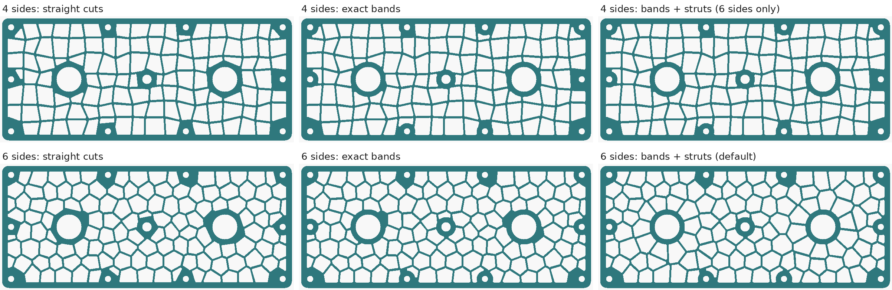
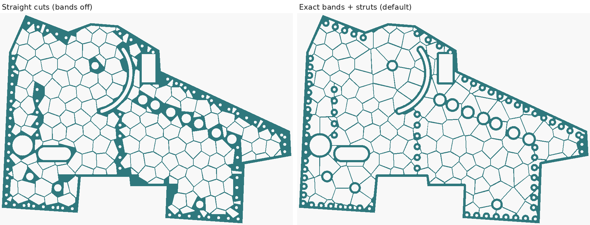
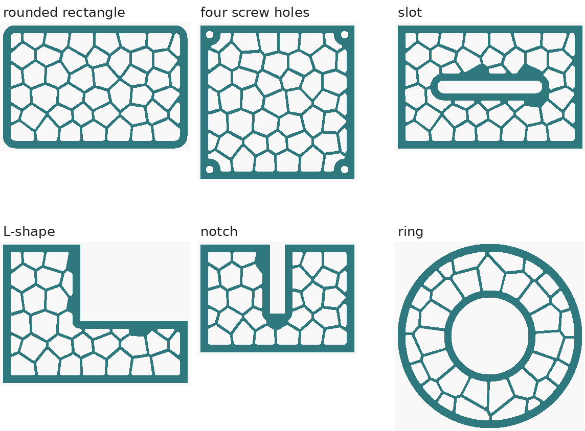

# LEOPARD VENT for Onshape — FeatureScript

The same venting / lightening pattern as the OpenSCAD generator, as an Onshape
custom feature: pick one or more planar faces, and it cuts irregular 3-, 4- or
6-sided holes into them with an exact rib between every pair. The material
left along the outline and round every hole already in the face — bolts,
bearings, slots, cutouts — is an exact offset of those edges, a band of
constant width that the pattern's ribs run straight into. With 6-sided cells,
circular holes also get struts: a ring of cells round each one, so its ribs
radiate out into the web.

File: [`featurescript/leopard_vent.fs`](../featurescript/leopard_vent.fs)







*All rendered from `tools/fsmirror.py`, the Python mirror of the feature's
geometry — not screenshots from Onshape. See "What has and has not been
tested" below. The first plate is 260 × 110 mm with ten 5.1 mm bolt holes,
two 22 mm bearing bores and an 8 mm hole, at default settings apart from the
cell shape. The second is modelled on a real FRC side plate, 630 × 420 mm with
about 90 bolt holes, a curved slot and several cutouts, with 6-sided 30 mm
cells: on the left with bands off — every hole cut straight, as the first
version did — and on the right as this version does by default.*

## Status — read this first

**The geometry is tested. The Onshape side has never been run end to end by
me** — I have no Onshape access. In practice:

- Every Onshape call it makes was checked by name and argument against the
  FeatureScript standard library source, version 2960 (May 2026). This
  version adds no new Onshape calls: the new code is plain maths, and the one
  new library function it uses, `atan2`, was checked the same way.
- All the maths — cells, outline handling, the bands, the struts, rounding,
  the exact lines and arcs it sketches — was executed outside Onshape and
  measured. See below.
- **First paste into Onshape (3083) found one error, since fixed:** `box` is a
  reserved word in FeatureScript, and the file used it as a variable name.
  `tools/fsinterp.py` now rejects FeatureScript's reserved words and enforces
  type annotations (`x is number`, `returns map`) the way Onshape does at run
  time, so the crosscheck catches both kinds of mistake. Every bit of syntax
  the new code uses — nested assignments like `loop[k].a = b`, `+=` on an
  array element, `while (true)` — also appears in Onshape's own library.
- **The bands and struts are new in this version** and replace the round
  rings and spoked wheels of the last one. If the feature errors, the Feature
  Studio's error panel gives a line number; that plus the message is enough
  to fix it.

## Installing

1. In any Onshape document, create a **Feature Studio**.
2. Select everything in it and paste `leopard_vent.fs` over it — **the whole
   file**, about 2,650 lines, ending with `holeArea`. Copy it with GitHub's
   "Copy raw file" button or from the downloaded file, not from a preview
   that may cut it short (a short paste shows up as
   `missing TOP_SEMI at '<EOF>'`). The file's first two lines are the ones
   Onshape writes for a new Feature Studio (`FeatureScript 3083;` and an
   import of `common.fs`). If your Onshape writes a newer number, keep yours.
3. In a Part Studio, add the feature to the toolbar through **Custom
   features**, choosing the document and Feature Studio you used. It appears
   as **Leopard vent**.

**Updating from the version with round rings and wheels:** paste the new file
over the old one. The options keep their internal ids, so features already in
your Part Studios keep their settings: *Round rings* on becomes *Exact bands*
on, *Ring width* becomes *Band width*, *Spokes* on becomes *Struts* on (used
with 6 sides only), and *Spokes only on holes from* carries over. Spoke thickness, length, count and
angle are gone, and their values are ignored. Every face with bands on will
change — that is the point of this version. To get the first version's
straight cuts, untick **Exact bands**.

## Controls

| Control | Default | What it does |
| --- | --- | --- |
| Faces | — | One or more planar faces of solid parts. Each gets its own pattern. |
| Cell shape | 4 sides | 4 sides: jittered grid. 3 sides: jittered triangle web. 6 sides: uneven Voronoi cells, closest to real leopard print, and the only shape with struts. |
| Cell size | 14 mm | Average cell width. Every shape is scaled so a cell has about the area of a square this wide. |
| Rib thickness | 2 mm | The web between neighbouring holes — guaranteed minimum. Down to 0.1 mm is allowed for laser or CNC; for FDM, stay at 0.8 mm (two extrusion widths) or more. |
| Border | 5 mm | Solid band kept along the outline of the face (and, with bands off, round every hole in it too). Raised to the rib thickness if set below it. |
| Irregularity | 0.7 | 0 is a regular grid, triangle web or honeycomb; 1 is as uneven as the cells can get while staying valid. |
| Hole corner radius | 1 mm | Rounds every hole corner, as true arcs. 0 leaves them sharp. |
| Smallest hole kept | 4 mm | A hole that cannot hold a circle this wide is left solid. |
| Seed | 1 | Which arrangement. |
| Fit cells to the face | on | Stretches the cells slightly so whole cells fill the face's bounding rectangle, with edge holes running straight along it. Off: the pattern runs past the face and is cut off at the border. |
| **Exact bands round holes and edges** | on | The material along the outline (*Border*) and round every hole already in the face (*Band width*) is an exact offset of those edges, and every pattern hole that meets it follows it. Off: straight cuts, as in the first version — see the left of each picture. |
| Band width round holes | 5 mm | Width of the band round every hole in the face — round, slotted, square or curved — from its edge. Raised to the rib thickness if set below it. A 5 mm band round a 5.1 mm bolt hole leaves a 15.1 mm boss. |
| **Struts round circular holes** | on | 6 sides only (hidden otherwise). Each circular hole of at least the size below gets a ring of cells round it, so the ribs between them run straight out from its band into the web. |
| Struts only on holes from | 10 mm | Smallest hole diameter that gets struts; smaller ones — bolt holes — just get their band. 0 gives struts to every circular hole that has room. Where two holes' rings of cells would overlap by much, only the bigger hole gets one. |
| Hole type | Through | Through the part, or a pocket of a set depth. **Through cuts everything of that part beneath each hole** — a boss or rib under the face gets cut too. Use Pocket to stop short of it. |
| Pocket depth | 2 mm | Pocket only. Measured from the face. |
| Pattern direction | — | Optional straight edge to align the pattern with. Left empty, it follows the face's longest straight edge — which is what lets a rectangular face be fitted exactly. |

When it finishes, the feature reports the hole count and open area (holes over
face area). It also says when the corner radius or smallest hole was limited.
As in the OpenSCAD version, those two are capped at 0.4 and 0.8 of the nominal
hole width, because past that whole cells start to vanish.

## How the bands work

Onshape has no dependable way to shrink a face's outline: offsetting a
boundary inward fails as soon as the offset is bigger than one of its fillets.
So the feature works the offset out itself, in maths.

**The band.** Take every edge of the face — the outline and every hole in it —
and offset it into the face by its clearance: the border for the outline, the
band width for a hole. A straight edge gives a parallel line, an arc a
concentric arc, and every inside corner an arc of the clearance's radius
round it. What lies beyond those offsets, on the face's side, is where holes
may go; call it E. It is exactly the set of points at least the border from
the outline and at least the band width from every hole.

**Each hole.** A cell is shrunk by half a rib, as always, and then by the
corner radius: its core. The hole is the part of the core inside E, grown back
by the corner radius. That part is worked out exactly, as an arrangement:
every core edge and every offset curve near the core is split where they
cross, the pieces on the boundary of core ∩ E are kept, and they are joined
end to end into loops. Each loop is sketched with every line moved out by the
corner radius, every arc's radius changed by it about the same centre, and an
arc of the corner radius round every corner. Where a hole runs along a band,
its edge is therefore a true line or arc at exactly the band width, and the
ribs on either side of it run straight into the band: nothing between the
band and the hole is filled in, which is what made the earlier versions look
chunky.

**Odd cases, all handled the safe way:**

- **A core that holds a whole hole and its band** — a bolt hole in the middle
  of a cell — would make a hole wrapped round the boss, leaving the boss loose.
  The core is split by a rib through the boss instead, at whichever of six
  angles keeps the most hole.
- **A core split into two pieces closer than a rib** by a band running across
  it is split again by a rib between them.
- **A boss whose band only just reaches past a cell's edge** — by less than
  about a quarter of a millimetre — would leave the hole wrapped almost all
  the way round it, holding the boss by a web thinner than a rib, or by
  nothing once the corners are rounded. That is split by a rib through the
  boss too.
- **A piece too small to hold the smallest hole** is left solid, as any hole is.
  That is why small solid wedges remain here and there, where a band leaves a
  cell only a sliver.
- **Faces with splines or other curves** that are neither line nor arc: those
  edges are sampled every 0.5 mm, and the loop they are in is kept a
  0.005 mm chord allowance further off. The chords are within 0.005 mm of a
  curve whose radius is at least 6.25 mm everywhere; on a tighter spline, the
  border there can come out up to 0.5² / (8 × radius) mm short — 0.016 mm on a
  2 mm radius.
- **A core whose loops cannot be drawn cleanly** — a piece under 0.01 mm that
  Onshape might choke on, a corner turning less than about 1° between an arc
  and anything, ends that do not meet up — is tried once more shrunk by
  0.05 mm, which moves every crossing. If that fails too, it gets the first
  version's straight cuts, kept the band width off every hole: convex, always
  drawable, never less material. How often, over every band test face at the
  defaults (`python3 tools/fsmirror.py fallbacks`: 13 faces, 3 cell shapes,
  struts on and off, 3 seeds — 234 plans, 12,065 holes): 70 holes retried,
  2 cut straight. Most retries are on the round face and the oval one; on the
  robot plate, 6 of 1,626 holes retried and none were cut straight.

## Struts

A circular hole of at least *Struts only on holes from* gets a ring of
Voronoi seeds round it, half a cell beyond its band, and the ordinary seeds
within about a cell of that ring are taken away. The cells of a ring of seeds
are wedges, so the ribs between them — ordinary cell edges, one rib thick like
every other — run straight out from the band, like spokes, and join the rest
of the web where the ring meets it. Nothing about them is special-cased: they
get the exact rib, bands and corner rounding of every other cell, and look
like part of the same pattern because they are. A knock on the bolt has a
straight path out into the plate along them.

The ring has about one seed per cell width of its circumference, and at
least 5, starting at an angle set by the seed. A hole whose ring of cells would
overlap a bigger hole's by much goes without: bigger holes first.

**The trade, honestly.** Struts are rib-thick, 2 mm by default. The wheels in
the last version had 3 mm spokes and a hoop; these have neither, and they
take nothing away from the open area — on the plates below, struts come out
slightly *more* open, because the ring of cells is a little coarser than the
pattern round it. If you want a beefier load path round the bores, raise the
rib thickness; a separate strut thickness is possible but not done.

## What it costs, and saves, in weight

Open area at default settings (bands with struts), against straight cuts and
against the last version's rings and wheels:

| Face | Cell shape | Straight cuts | Rings + wheels (last version) | Exact bands | Bands + struts |
| --- | --- | --- | --- | --- | --- |
| Side plate, 260 × 110 | 4 sides | 58.1% | 57.2% | 58.6% | — |
| | 3 sides | 52.7% | 53.0% | 53.6% | — |
| | 6 sides | 58.7% | 57.3% | 59.2% | 60.1% |
| Robot plate, 630 × 420, 30 mm cells | 4 sides | 62.9% | 65.1% | 69.9% | — |
| | 3 sides | 61.3% | 63.6% | 68.3% | — |
| | 6 sides | 63.6% | 65.8% | 70.2% | 71.1% |

On the robot plate (144,404 mm² of face) the step from the last version to
this one, 65.8% to 71.1% with 6 sides, is about 7,650 mm² less plate: about
21 g for every millimetre of thickness in aluminium — 66 g at 1/8", 124 g at
6 mm. That is the solid wedges of the straight cuts and the wheels' hoops
coming out.

**About strength.** The rib, border and band widths are guaranteed *minimum*
widths, measured below. That is geometry, not an analysis: I have not run any
FEA on these patterns. More open area is less material, and less material is
less stiff. For a plate that takes impacts, the levers are rib thickness,
band width and cell size.

## Bands off: straight cuts

With *Exact bands* off, the feature does what its first version did:

- Each boundary edge is sampled into chords, at most 0.005 mm off a curve
  (see above for splines), with the face kept on the left — so the outer loop
  runs one way, holes in the face the other, and the feature can tell them
  apart.
- Every hole starts as a convex polygon. It is clipped by the boundary chords
  near it, each moved in by the border (plus that 0.005 mm). That is **exact
  for a convex outline**. Near an inside corner it trims holes more than
  strictly needed, never less: the solid blocks in the left-hand pictures.
- **Holes already in the face** are kept the border clear with one straight cut
  per hole — per triangle, for a hole that is not convex — chosen from several
  directions to keep the most of it. Exact alongside a straight side,
  conservative beside a curve.

Each hole's polygon is then sketched as its edges pushed out by the corner
radius, joined by arcs of that radius: the exact rounded shape. All holes on a
face go into one sketch, are extruded together and subtracted in one boolean,
and the sketch is deleted. That last part is the same with bands on.

## What has and has not been tested

Reproduce with:

```bash
python3 tools/fsmirror.py check        # the geometry, measured (about 1.5 hours on 2 cores)
python3 tools/fsmirror.py crosscheck   # the .fs file's own code, against it (about 20 minutes)
python3 tools/fsmirror.py fallbacks    # how often the bands retry, or fall back to straight cuts
```

**`fsmirror.py check` — the geometry is right.** `tools/fsmirror.py` is a
Python mirror of the feature's maths, function for function. Every hole is
measured with shapely against the *true* outline — real circles, not the
chords the feature uses — for:

- the thinnest web between any two holes;
- the closest any hole comes to the outline, and — with bands on — to every
  hole in the face (round holes as true circles);
- that every hole lies inside the face, that no piece of the plate is left
  loose, and that no outline crosses itself;
- that no hole wraps round part of the plate and holds it by a web thinner
  than the rib (each hole, grown by half a rib, must not close round
  anything);
- that every sketched outline is exactly the rounded shape it stands for:
  each loop closes, and every point along every line and arc is the corner
  radius from the hole's core, to 1e-6 mm;
- the smallest hole.

The measurement errs on the safe side: every curved edge of the face is
sampled so that clearances to it come out at most 5e-7 mm *smaller* than the
truth, never larger, and the arcs of the holes themselves at most 1e-7 mm.

Three matrices, each case 3 seeds:

- **Straight cuts** (bands off — the first version): ten faces — rectangle,
  rounded rectangle, circle, plate with four screw holes, plate with a big
  centre hole, plate with a slot, L-shape, notched plate, ring, and a plate
  with a curved slot and an L-shaped cutout — × 3 cell shapes × 9 settings:
  **810/810 pass**, every hole identical to the last version's.
- **Exact bands:** those ten, the side plate at the top, a plate with three
  holes close enough that their bands overlap, and a plate with an oval
  hole, an oval notch and a domed top — edges that are neither line nor arc,
  sampled as a spline would be — × 3 cell shapes × 11 settings (band 1–10 mm,
  struts on every round hole or only from 10 mm, rib 0.8–4 mm, corner radius
  0–4 mm, irregularity 0–1, cropped as well as fitted): **1,287/1,287 pass**.
- **The robot plate** at the top, with 30 mm cells: straight cuts, bands,
  bands and struts, smallest hole 10 mm, and struts on every round hole:
  **45/45 pass**.

To 1e-6 mm, on the safe side: no web thinner than the rib, no hole nearer
than the border to the outline or nearer than the band width to a hole in the
face; none outside the face, no loose pieces, no outline off its exact shape.
At the defaults (bands 5 mm; struts on with 6 sides; the robot plate with
30 mm cells; band — : no hole in that face; `curved=` counts holes that
follow a band or the outline's offset, `straight=` the ones that fell back to
straight cuts):

```
  rect_120x80     QUAD holes=40   rib=2.0000 border=5.0000 band=  —    curved=22 straight=0 smallest=8.721 open=61.3%
  rect_120x80     TRI  holes=44   rib=2.0000 border=5.0000 band=  —    curved=18 straight=0 smallest=5.013 open=56.8%
  rect_120x80     HEX  holes=45   rib=2.0000 border=5.0000 band=  —    curved=21 straight=0 smallest=5.545 open=61.0%
  rounded_rect    QUAD holes=40   rib=2.0000 border=5.0000 band=  —    curved=22 straight=0 smallest=8.721 open=61.6%
  rounded_rect    TRI  holes=44   rib=2.0000 border=5.0000 band=  —    curved=18 straight=0 smallest=5.013 open=57.1%
  rounded_rect    HEX  holes=45   rib=2.0000 border=5.0000 band=  —    curved=21 straight=0 smallest=5.545 open=61.3%
  circle_d100     QUAD holes=40   rib=2.0000 border=5.0000 band=  —    curved=40 straight=0 smallest=4.476 open=57.0%
  circle_d100     TRI  holes=35   rib=2.0000 border=5.0000 band=  —    curved=35 straight=0 smallest=4.041 open=56.4%
  circle_d100     HEX  holes=37   rib=2.0000 border=5.0000 band=  —    curved=37 straight=0 smallest=5.066 open=61.6%
  rect_4_screws   QUAD holes=48   rib=2.0000 border=5.0000 band=5.0000 curved=23 straight=0 smallest=4.922 open=57.8%
  rect_4_screws   TRI  holes=43   rib=2.0000 border=5.0000 band=5.0000 curved=17 straight=0 smallest=5.757 open=55.8%
  rect_4_screws   HEX  holes=45   rib=2.0000 border=5.0000 band=5.0000 curved=22 straight=0 smallest=4.460 open=60.2%
  plate_big_hole  QUAD holes=54   rib=2.0000 border=5.0000 band=5.0000 curved=44 straight=0 smallest=5.025 open=57.2%
  plate_big_hole  TRI  holes=56   rib=2.0000 border=5.0000 band=5.0000 curved=33 straight=0 smallest=5.067 open=52.4%
  plate_big_hole  HEX  holes=46   rib=2.0000 border=5.0000 band=5.0000 curved=36 straight=0 smallest=4.830 open=60.0%
  plate_slot      QUAD holes=34   rib=2.0000 border=5.0000 band=5.0000 curved=29 straight=0 smallest=8.721 open=53.4%
  plate_slot      TRI  holes=44   rib=2.0000 border=5.0000 band=5.0000 curved=36 straight=0 smallest=4.648 open=50.0%
  plate_slot      HEX  holes=42   rib=2.0000 border=5.0000 band=5.0000 curved=31 straight=0 smallest=4.443 open=52.2%
  l_shape         QUAD holes=31   rib=2.0000 border=5.0000 band=  —    curved=22 straight=0 smallest=4.155 open=54.2%
  l_shape         TRI  holes=32   rib=2.0000 border=5.0000 band=  —    curved=23 straight=0 smallest=4.866 open=52.8%
  l_shape         HEX  holes=30   rib=2.0000 border=5.0000 band=  —    curved=20 straight=0 smallest=5.363 open=55.5%
  notched         QUAD holes=25   rib=2.0000 border=5.0000 band=  —    curved=21 straight=0 smallest=7.932 open=53.9%
  notched         TRI  holes=25   rib=2.0000 border=5.0000 band=  —    curved=17 straight=0 smallest=6.014 open=50.7%
  notched         HEX  holes=29   rib=2.0000 border=5.0000 band=  —    curved=22 straight=0 smallest=4.460 open=52.2%
  annulus         QUAD holes=43   rib=2.0000 border=5.0000 band=5.0000 curved=43 straight=0 smallest=4.048 open=51.8%
  annulus         TRI  holes=46   rib=2.0000 border=5.0000 band=5.0000 curved=46 straight=0 smallest=4.420 open=50.6%
  annulus         HEX  holes=35   rib=2.0000 border=5.0000 band=5.0000 curved=35 straight=0 smallest=5.635 open=57.1%
  slots_plate     QUAD holes=78   rib=2.0000 border=5.0000 band=5.0000 curved=53 straight=0 smallest=4.109 open=54.1%
  slots_plate     TRI  holes=77   rib=2.0000 border=5.0000 band=5.0000 curved=49 straight=0 smallest=4.422 open=50.6%
  slots_plate     HEX  holes=83   rib=2.0000 border=5.0000 band=5.0000 curved=57 straight=0 smallest=4.024 open=55.8%
  side_plate      QUAD holes=117  rib=2.0000 border=5.0000 band=5.0000 curved=67 straight=0 smallest=4.455 open=58.6%
  side_plate      TRI  holes=135  rib=2.0000 border=5.0000 band=5.0000 curved=58 straight=0 smallest=4.058 open=53.6%
  side_plate      HEX  holes=120  rib=2.0000 border=5.0000 band=5.0000 curved=71 straight=0 smallest=4.095 open=60.1%
  cluster         QUAD holes=46   rib=2.0000 border=5.0000 band=5.0000 curved=31 straight=0 smallest=6.194 open=56.6%
  cluster         TRI  holes=44   rib=2.0000 border=5.0000 band=5.0000 curved=27 straight=0 smallest=4.565 open=54.3%
  cluster         HEX  holes=44   rib=2.0000 border=5.0000 band=5.0000 curved=29 straight=0 smallest=5.635 open=58.4%
  ellipses        QUAD holes=56   rib=2.0000 border=5.0023 band=5.0030 curved=36 straight=0 smallest=4.109 open=56.9%
  ellipses        TRI  holes=63   rib=2.0000 border=5.0025 band=5.0030 curved=40 straight=0 smallest=4.141 open=52.0%
  ellipses        HEX  holes=61   rib=2.0000 border=5.0023 band=5.0030 curved=37 straight=0 smallest=4.278 open=57.2%
  robot_plate     QUAD holes=184  rib=2.0000 border=5.0000 band=5.0000 curved=140 straight=0 smallest=4.207 open=69.9%
  robot_plate     TRI  holes=190  rib=2.0000 border=5.0000 band=5.0000 curved=145 straight=0 smallest=4.086 open=68.3%
  robot_plate     HEX  holes=166  rib=2.0000 border=5.0000 band=5.0000 curved=126 straight=0 smallest=4.397 open=71.1%
```

The border and band read a few microns over 5 only on the oval face, whose
curves are neither line nor arc — that is the 0.005 mm chord allowance, added
on the safe side. Everywhere else they read exactly 5, round outlines and
round holes included: arcs are offset as true arcs.

**`fsmirror.py crosscheck` — the `.fs` file does the same thing.**
`tools/fsinterp.py` is a small interpreter for the subset of FeatureScript the
feature's maths is written in. `crosscheck` runs the actual functions in
`leopard_vent.fs` — outline handling, cells, struts, the bands, every hole,
hole areas, and the exact `skLineSegment` / `skArc` calls `drawHole` makes —
and requires the answer to match the mirror point for point.

Result: **587/587 cases identical** — 210 stage by stage with straight cuts on
10 faces; 351 through the whole plan on the 13 band faces (9 settings, from
bands off to bands with struts, × 3 cell shapes); 12 on the robot plate; the
two cases the matrices miss, run by name — the one test case that falls back
to straight cuts, and the robot plate case split at a neck; and the fallback
itself, run on every cell of four faces with holes. 32,003 holes in all,
compared point by point: 20,049 plain, 11,024 following a band, 930 cut
straight. The
interpreter also checks every type annotation as Onshape does at run time,
so a wrong `returns map` or `is Vector` fails here rather than in your Part
Studio.

What it has caught, over the versions: a constant mistyped after its tenth
digit; a Python list that hid the *Fit cells* setting in the mirror; a
last-digit tie next to a curved slot. This version: on round outlines, fitted
cells' cores end up exactly tangent to the border's offset, and whether the
two meet at all came down to the 16th digit — Python and FeatureScript
disagreed, and one of them made a 0.0000003 mm sliver of a piece. Lines and
arcs that come within 1e-9 mm of touching are now taken not to meet, which
settles it the same way in both, and took the number of retried holes from
117 to 70. Writing the crosscheck also showed that cropped cells with struts
could not be bounded: a seed at the edge of the pattern has an open Voronoi
cell, and the code only stopped when the numbers overflowed. Cropped strut
cells are now clipped to the face's box grown by a cell's reach. And the
measured check on the robot plate found one hole, on one seed, wrapped round
a bolt boss whose band poked 0.02 mm past the cell's edge: rounded, the hole
closed round the boss and its outline crossed itself. Nothing measured until
then could see that — the web between two holes was measured, not the web
inside one — so the check now measures that too, and such necks are split
like a boss inside a cell.

**Not tested — needs Onshape:**

- That the file loads and runs end to end.
- That `evCurveDefinition` reports a hole's edge as a `Circle` whose centre
  maps into the face's plane where the edge is. Checked against the standard
  library's types, not against Onshape. If it did not, round holes would be
  offset from their chords instead — a band 0.005 mm wider, and no struts.
- That a solid's planar face reports its normal pointing out of the material
  (standard B-rep convention). The cut runs against that normal; if it were
  reversed, the cutters would miss the part.
- That Onshape finds the sketch regions from loops of lines and arcs whose
  endpoints match exactly but carry no coincidence constraints.
- Speed. A hole along a band is a line or arc per piece plus a corner arc per
  corner — typically 8 to 20 sketch entities; the robot plate is about 2,200
  in one sketch. The maths per hole is heavier than the straight cuts': each
  core is crossed with every offset curve near it. The mirror plans the robot
  plate in about a quarter of a second of Python; the interpreter, which is
  far slower than Onshape, takes about 15 seconds — less than the 22 it
  takes over straight cuts, since a round hole is one exact arc to the bands
  but dozens of chords to the straight cuts. How long Onshape takes is
  unknown.
- Selecting several faces of one part, and faces on opposite sides of a part.

## Same pattern as the OpenSCAD version

Both use the same hash, lattices and cell construction. On a matching
rectangle they produce the same pattern for the same seed. Checked: on a
120 × 80 face with default settings and bands off, the mirror gives the same
40 holes that `ribcheck.py` measured on the OpenSCAD export. A design can be
roughed out in either and carried to the other. The bands and struts are only
in the FeatureScript: the OpenSCAD generator makes panels, which have no holes
of their own to work round.
