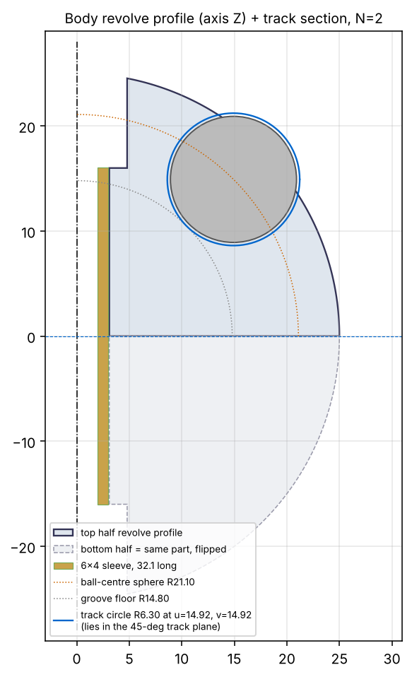
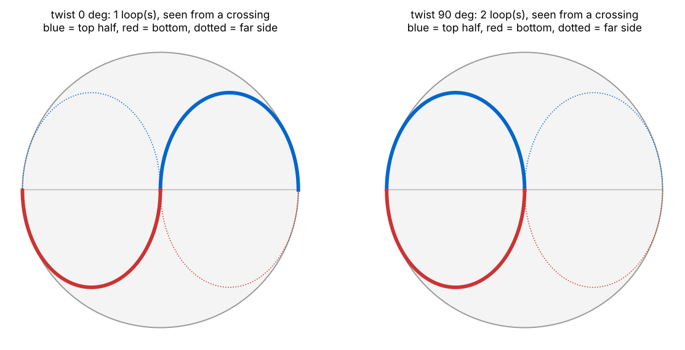
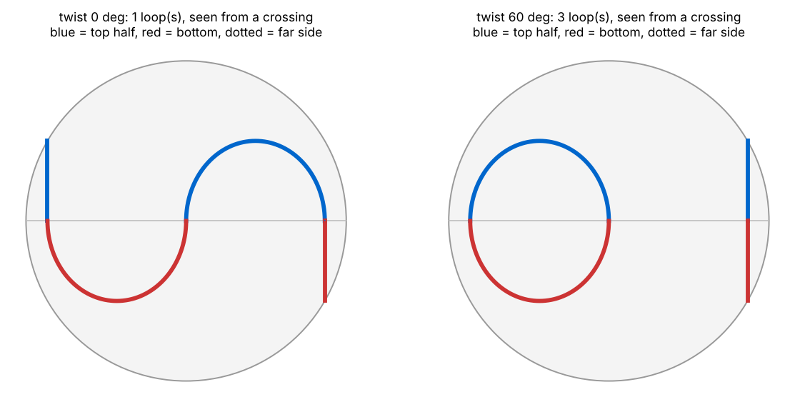

# Orbit Ball — dimensions for an Onshape model

**Status: research plus derived geometry. Nothing here was measured on a
physical toy, and nothing has been printed.**

- **Sourced** from retail and wholesale listings: the outer envelope, the
  ball count and the twist action.
- **Not found by the search** that ran: the ball diameter, groove, wall and
  track path. That search had limits:
  - It covered ~180 listing queries in English and Chinese.
  - Its query budget ran out before the patent, teardown-video and
    printable-replica searches ran.
  - Taobao and 1688 detail pages were not reachable.
- **Derived here** instead, and checked by `tools/orbitfit.py`.

Every value below is labelled with which of these it is.





## Which toy

The target is the white, diamond-pattern "Orbit Ball" with a blue/teal track
and three metal balls. The white-and-blue diamond version is listed at
Walmart 3692433535 / 3651449451 (Innotech, "Pattern: Diamond").

**Listings that probably share its mould.** This is likely but not
confirmed; the evidence is matching sizes and matching copy.

| Seller or brand | Name / model | Note |
| --- | --- | --- |
| ONCOFAN | DIMI DM-17, "track pinball" | |
| Etokfoks | | |
| AHEYE | "Three Bead Orbit" | |
| Gear Elevation | | |
| Made-in-China wholesalers | "Bead Orbit" | |
| EPROLO (a dropship platform) | "Diamond Pattern Ball Track Gyroscope Magic Cube" | |
| TRACYCY | | possibly a different mould: listed 2.32 × 2.24 × 2.2 in |
| EMPHASISY | | possibly a different mould |

Your alias "Spiral Orbit Marble Puzzle Ball" is also used by Curious Minds,
for a 1.75 × 2 in one-piece toy. That may be a different product.

US design patent D1056062 "Orbit ball toy" (filed 2021-12-15) may show this
family:
- Its 10 drawing views could confirm or rule out the track path used here.
  They were not retrieved; the USPTO PDF is at
  `image-ppubs.uspto.gov/dirsearch-public/print/downloadPdf/D1056062`.
- It gives no dimensions.
- It cites a TRACYCY listing as prior art, so it is not confirmed to show
  the diamond version.

## What the sources say

| Fact | Value | Basis and strength |
| --- | --- | --- |
| Envelope | ≈ 50 × 50 × 56 mm: 1.96 × 1.96 × 2.2 in, or 5 × 5 × 5.6 cm | Most listings: ONCOFAN B09XN555KR / B0DH4P9345, Lowe's 8219706, B0BLV43KYG, Etsy 4362748570, Alibaba 1600481553290, Made-in-China ctwj2018. Many resellers copy one supplier spec, so these are not independent. |
| Other envelope figures | 52 × 52 × 56 · 52 × 56 × 56 · 50.8–51 · 56.4 × 50 × 50 mm | 52 × 52 × 56: Alibaba Shantou Yaxin "product size", Amazon UK; Tombo calls it *packing* size. 52 × 56 × 56: EPROLO diamond listing, Amazon.sa. 50.8–51: EMPHASISY, WUQID. 56.4 × 50 × 50: B0DPDH7KY4, which could not be re-found by a second search. |
| Shape | Listings also say "polyhedron ball", "Cube ball", "rounded corners", "arch-shaped grip" | Innotech, Autastic, listing copy. The body **may not be a true sphere**; this model assumes it is. |
| Balls | **3**, metal | 3: EPROLO ("three iron beads on the diamond surface"), eBay 235678383048 ("With 3 Balls"; could also mean three toys), AHEYE ("Three Bead Orbit"), Autastic ("3 balls into 3 different levels"). Against: one Q&A guess says 1, and generic copy says "the metal ball". |
| Ball material | **Unresolved**: steel or aluminium | "plastic + steel ball" (ONCOFAN), "iron beads" (EPROLO). "Aluminum bead" in EMPHASISY, Coolbe and others. |
| Action | Two halves twist. Balls roll along a grooved track. Twisting "switches" or "toggles" the track and "creates new paths". | EMPHASISY B0DK36WK9V, Amazon Q&A Tx3ND6QIUJ2SE9Q, Autastic, "polyhedron ball" listing copy |
| Track count | "altogether or on **3 individual tracks**"; "3 balls into 3 different levels" | Sensory Toolhouse "Bead Orbit" (same family as the 5 × 5 × 5.6 cm wholesale "Bead Orbit"); Autastic review |
| Balls visible at the surface | "metal balls visible between the [white diamond] segments" and "blue curved sections"; one reviewer says a ball can be "knock[ed] out of the track" | Etsy auto-generated image caption, EPROLO machine-translated summary, one Amazon reviewer on an unidentified listing. **All weak, none a photo.** You described an *internal* track. This design assumes the surface version. |
| Body | ABS; matte "Pattern: Diamond" | ABS: Innotech, Lowe's, Gear Elevation, Etsy. Diamond: Innotech. "Raised" is from your description. Etsy also lists silicone (perhaps the blue track); one wholesaler says PVC. |
| Assembly | "unable to be disassembled" | Walmart 3254741685 |
| Mass | ~50 g, given as 0.05 kg / 1.76 oz | Rounded, so 45–55 g. Possibly a template value or boxed weight. Other single-unit figures: 23, 41, 53, 68, ~100, 109 g. |
| Magnets | some related listings say "magnetic" | Amazon.sa B0CFXXL9BT, Alibaba 1600263193337. Role unknown. |

## Why a single Revolve cannot make it, and what can

**The rule.** Two parts with a shared spherical outside can only twist
against each other if the boundary between them is a circle about the twist
axis. This model puts that circle on the equator, so the parting face is
flat. **The S / yin-yang you see is the track, not the split.** A track that
changes when twisted cannot be axisymmetric about the twist axis.

**The construction.** The track is made of `2·Lobes` semicircles on the
ball-centre sphere:
- Each semicircle joins two equator crossings, `180/Lobes` degrees apart, and
  crosses the equator vertically.
- Each lies in a vertical plane `Track_Offset` from the twist axis, with
  radius and apex height `Arc_R`.
- The top half carries `Lobes` of them. The bottom half carries the rest, and
  is **the same part flipped 180° about X**.
- At 0° twist they join into **one loop**. Twisted `180/Lobes` degrees they
  become **`Lobes` separate rings**.
- Every semicircle is a torus segment whose axis runs through the sphere
  centre. So each groove is an **ordinary Revolve cut about an axis that
  lies in the parting plane**.
- These are the "track circles offset from the central axis" you asked
  about. The circle sits `Track_Offset` out along that axis and `Arc_R`
  above it.

| | `Lobes = 2` | `Lobes = 3` |
| --- | --- | --- |
| Looks like | the classic yin-yang S (each lobe half the diameter) | a wave round the equator; also an S when viewed face-on to a crossing |
| Twist to split | 90° → 2 rings | 60° → **3 rings, one per ball** |
| Fits | your S / yin-yang description | the only two sources that count tracks ("3 individual tracks", "3 levels") |
| Margins | walls 17.2 mm, magnets 6.3 mm from grooves | walls 8.5 mm, magnets 2.1 mm from grooves |

**This path is a reconstruction, not a copy of a drawing.** I chose it
because:
- it reproduces the sourced behaviour;
- each groove is a plain Revolve;
- it fits your yin-yang description.

Other layouts also fit the evidence. One is three stacked latitude rings
("levels") joined by gaps that line up when twisted; that version is not
modelled here.

What does and does not depend on the path:
- The groove section, retention and joint numbers below hold for any path.
- `Track_Offset` and `Arc_R` depend on the path.
- A stacked-ring design would have different values for both.

## Onshape variables

How to enter them:
- Create one variable per row in a Variable Studio, then insert it with
  *Variable table → Insert Variable Studio*. Alternatively, use Variable
  features above the first feature that uses them.
- Names have **no `#`**. Write `#` only when referring to a variable.
- Set the type to Length, Angle or Number as the expression implies.
- Put the Basis text in the Description field.

Basis: **S** sourced · **D** derived by formula · **E** engineering choice ·
**R** reference only.

| Name | Expression | Value | Basis |
| --- | --- | --- | --- |
| `Sphere_Dia` | `50 mm` | 50 | S/D listing width (49.8–52), assumes a true sphere |
| `Lobes` | `2` | 2 | E. 2 = yin-yang S; 3 = three tracks (see above) |
| `Ball_Count` | `3` | 3 | S |
| `Ball_Dia` | `12 mm` | 12 | **E, not sourced** (see "Ball diameter") |
| `Groove_Clr` | `0.3 mm` | 0.3 | E. Radial clearance, steel ball to printed groove |
| `Ball_Sink` | `3.9 mm` | 3.9 | E. Ball centre below the shell |
| `Lip_Fillet` | `0.3 mm` | 0.3 | E. Modelled on the groove lip; with Ball_Sink it sets retention |
| `Sphere_R` | `#Sphere_Dia / 2` | 25 | D |
| `Groove_R` | `#Ball_Dia / 2 + #Groove_Clr` | 6.3 | D. Groove Ø12.6 |
| `Track_R` | `#Sphere_R - #Ball_Sink` | 21.1 | D. Ball-centre sphere |
| `Track_Angle` | `90 deg / #Lobes` | 45° | D. Track sketch plane, measured from Front |
| `Track_Offset` | `#Track_R * cos(#Track_Angle)` | **14.920** | D. Arc-plane offset from Z (sketch u) |
| `Arc_R` | `#Track_R * sin(#Track_Angle)` | **14.920** | D. Arc radius = apex height (sketch v) |
| `Floor_R` | `#Track_R - #Groove_R` | 14.8 | D. Groove floor 10.2 below the shell |
| `Mouth_W` | `2 * sqrt(#Sphere_R^2 - ((#Track_R^2 + #Sphere_R^2 - #Groove_R^2) / (2 * #Track_R))^2)` | 10.709 | R. Sharp-edge mouth; 0.36 mm/side after the fillet |
| `Bore_Dia` | `6.2 mm` | 6.2 | E. Drill or ream to 6.05–6.1 for the 6 mm sleeve |
| `Pocket_Dia` | `9.6 mm` | 9.6 | E. Round, both poles |
| `Pocket_Depth` | `9 mm` | 9 | E |
| `Sleeve_L` | `2 * (#Sphere_R - #Pocket_Depth) + 0.1 mm` | 32.1 | D. 0.1 mm end play for the halves |
| `Magnet_R` | `20 mm` | 20 | E. 13.5 mm when Lobes = 3 |
| `Magnet_Hole` | `4.2 mm` | 4.2 | E. For Ø4 × 2 mm magnets |
| `Magnet_Depth` | `2.4 mm` | 2.4 | E. 0.3 mm recess plus a glue film |
| `Lead_In` | `1 mm` | 1 | E. 45° chamfer where the grooves meet the parting face |
| `Rim_Chamfer` | `0.5 mm` | 0.5 | E. Gives a 1 mm V seam |
| `Nub_H` | `0 mm` | 0 | E. 2.95 mm reaches 55.9 pole to pole, if the listed length is on the twist axis |

For `Lobes = 3`: `Track_Offset` = 18.273, `Arc_R` = 10.550,
`Magnet_R` = 13.5, and there are 6 magnets per half.

Before changing `Ball_Dia`, `Ball_Sink`, `Lip_Fillet` or `Lobes`, run
`python3 tools/orbitfit.py --ball … --sink … --fillet … --lobes …`.
Retention is sensitive to the sink:

| `Ball_Sink` (12 mm ball, 0.3 mm fillet) | 3.8 | **3.9** | 4.0 |
| --- | --- | --- | --- |
| Retention per side | 0.31 | **0.36** | 0.42 |
| Ball proud of shell | 1.9–3.0 | **1.8–2.9** | 1.7–2.7 |

## Answers to your three questions

### 1. Ball diameter

**I cannot give you the specific figure, because no source that the search
reached states it.** That covers every listing, Q&A, review and wholesale
page in English or Chinese. Anyone quoting 11, 12 or 12.7 mm without
measuring a unit is guessing.

What the evidence does allow:

- **Geometry does not decide it.** Balls from 6 to 12.7 mm all pass every
  check (`orbitfit --sweep`).
- **Mass leans, weakly, towards the larger sizes.** The ~50 g figure is
  reached by a moulded ABS body with:

  | Ball | Wall for 50 g |
  | --- | --- |
  | 12–12.7 mm | ~2.5 mm |
  | 11 mm | ~3 mm |
  | 10 mm | ~3.5 mm |
  | 6–8 mm | ~5 mm |

  Typical moulded toy walls are 2–2.5 mm, which favours 12–12.7 mm. But the
  wall is unknown, and each 1 mm of wall adds ~9 g (as much as going from
  10 mm to 12 mm balls). The listed weight is rounded to ±5 g and may include
  a box. A separate blue track insert would push the answer smaller.
- **The envelope tells you nothing.** How far the balls stand proud is set by
  `Ball_Sink`, which is a design choice, so it cannot reveal the ball size.
  Balls also cannot add to the pole-to-pole length: the highest ball point is
  below the pole.

**Design value: `Ball_Dia = 12 mm`.**
- It sits in the band (10–12.7 mm) that the weight and proportions allow.
- It is a stock size; so are 10, 11 and 12.7 mm, so that is convenience, not
  evidence.
- If you buy ½″ balls, set 12.7 mm and `Ball_Sink = 4.07`.
- For 11 mm, set `Ball_Sink = 3.66`.
- Either way the retention stays at 0.36 mm/side.

### 2. Sphere profile

- **OD: 50 mm.** This is the listing width (52 mm in some listings). It was
  not measured on a bare shell.
- **Wall: no published value.** Injection-moulded ABS toys are usually
  1.5–2.5 mm; that figure is only used in the mass estimate above. For FDM,
  use 4 perimeters (≥ 1.6 mm) and 15 % infill. That gives a body of ~28 g, and
  ~49 g with three 12 mm balls. Material between groove and pocket is
  ≥ 3.8 mm.
- **Groove depth: the floor is 10.2 mm below the shell.** This follows from
  the 12 mm / 3.9 mm choices, not from the commercial toy.
- **Ball seating, in this design: not 50 %.** An open groove sunk to the
  ball's equator has a mouth as wide as the ball, and the ball falls out.
  - The ball centre is 3.9 mm below the shell, so about 82 % of the ball is
    below the shell line.
  - Filleted lips 10.7 mm apart hold it with 0.36 mm per side.
  - It stands 1.8–2.9 mm proud of the shell.

  How the commercial toy seats its balls is **unknown**. If they are captured
  between the halves, or held by magnets (some listings say "magnetic"),
  50 % seating is possible.

### 3. "S" curve and gap

- **Track circle offset from the central axis: 14.920 mm (`Track_Offset`).**
  The arc radius and the apex height are also 14.920 mm. For `Lobes = 3` the
  values are 18.273 and 10.550 mm. All of them follow from the chosen ball,
  sink and path; none was taken from the commercial toy.
- **The parting line is flat.** It is the equator, not an S.
- **Gap between the halves: 0 mm at the faces.**
  - The halves sit face to face, pulled together by the magnets.
  - The visible seam is the 1 mm V from two 0.5 mm rim chamfers.
  - A 0.15 mm face relief (my first draft) cannot be printed. It would sit on
    the bed face and is thinner than one layer, so it only suits a moulded or
    resin part.
- **Clearances that matter:**

  | Where | Clearance | Basis |
  | --- | --- | --- |
  | Ball to groove | 0.3 mm radial | printed surface against a precise steel part, where 0.2–0.3 mm is normal |
  | Sleeve to bore | ≤ 0.05 mm radial | reamed |
  | Axial end play | 0.1 mm | set by the sleeve |

  For printed-on-printed moving parts, vendor guidance (JLC3DP; UZH AMF FDM
  guideline) is 0.4–0.5 mm. Nothing here slides printed-on-printed except the
  greased faces. Wobble is set by the bore and sleeve, not by the seam gap.
- **Alignment budget.** A ball crosses the seam freely if the two grooves line
  up within 2 × `Groove_Clr` = 0.6 mm, which is 1.6° of twist. The 1 mm
  lead-in chamfers take up most of what the detents leave over.

## Building it in Onshape

1. **Variables** as above.
2. **Body**: sketch on *Front*.
   - Draw a construction line on the vertical axis through the origin (Z).
   - Draw the closed profile: from (`Bore_Dia/2`, 0) out to (`Sphere_R`, 0).
   - Then an arc centred on the origin, radius `Sphere_R`, up to
     x = `Pocket_Dia/2`.
   - Then down to z = `Sphere_R − Pocket_Depth`, in to x = `Bore_Dia/2`, and
     back down to 0.
   - **Revolve, Full**, about the construction line. This gives the top half,
     with bore and pole pocket included.
3. **Track plane**:
   - Show Sketch 1 (eye icon).
   - *Plane → Line angle*: select the Z construction line, then the *Front*
     plane as the reference, angle `#Track_Angle`.
4. **Track sketch** on that plane:
   - *Use* (project) the Z line.
   - Draw a construction line from the origin, *Perpendicular* to it. This is
     the revolve axis; it lies in the parting plane.
   - Draw a circle with diameter `2 * #Groove_R` (Onshape dimensions circles
     by diameter). Put its centre `#Track_Offset` from the projected Z line
     and `#Arc_R` from the revolve axis, above it.
   - Do not use Horizontal or Vertical constraints in this sketch.
   - **Revolve → Remove → Full** about the construction line, with merge scope
     set to the top half. The lower half of that torus is outside the part,
     so a Full revolve and a ±90° revolve remove the same material.
5. **Circular pattern** (*Feature pattern*) of that Revolve:
   - Axis: the bore's cylindrical face.
   - Instances: `#Lobes`, over 360°, with *Equal spacing* ticked.
6. **Lip fillet** of `#Lip_Fillet` on the groove/shell intersection edges.
7. **Chamfers**:
   - `#Lead_In` on the groove-end edges at the parting face. There are
     `2 * #Lobes` of them.
   - `#Rim_Chamfer` on the rim arcs.
8. **Magnet holes**:
   - Sketch on *Top*: one circle of diameter `#Magnet_Hole`, at radius
     `#Magnet_R`, at angle `#Track_Angle` from Front.
   - *Extrude → Remove* `#Magnet_Depth` into the part.
   - Circular pattern: `2 * #Lobes` instances. With 2 lobes they land at 45°,
     135°, 225° and 315°, on every arc axis.
9. **Bottom half**:
   - *Transform*, type *Rotate*, with *Copy part* ticked.
   - Axis: the z = 0 edge of Sketch 1, which lies on X, or the X axis of an
     origin mate connector. Angle 180°.
   - Do not rotate about the 45° line. That puts the lower arcs in the wrong
     planes and swaps which twist gives one loop.
10. **Balls** (visual):
    - In a copy of the track sketch, draw a semicircle of diameter
      `#Ball_Dia` on the groove-circle centre, closed by a line through that
      centre.
    - *Revolve → New → Full*.
    - Copy the result by Transform, or place the balls in an Assembly.
11. **Caps**, optional:
    - Ø9.5 plugs.
    - The nut-end cap gets a Ø4.6 × 1.5 mm recess for the bolt tip.
    - Any spin nub (`Nub_H`) goes on the head-end cap, which has 3.7 mm of
      engagement. The nut-end cap has 2.7 mm.

**Hardware**:
- 6 mm OD brass or aluminium tube with a 4.2–4.5 mm bore (0.75–0.9 mm wall),
  cut to `Sleeve_L` = 32.1 mm. A nominal 4.0 mm bore can bind on the M4
  thread, which is up to 3.98 mm across.
- M4 × 40 socket-head cap screw (ISO 4762).
- 2 × M4 washers (DIN 125, Ø9 × 0.8).
- M4 nylon-insert lock nut (DIN 985). It protrudes 1.3 mm.
- Magnets: 8 for 2 lobes, 12 for 3 lobes, Ø4 × 2 mm N42.
- 3 balls.
- Dry PTFE or silicone lube.

The bolt clamps only the sleeve. The halves float on it with 0.1 mm of end
play, held together by the magnets. Preload therefore cannot drift, and the
bolt never turns in the nut.

**Assembly order**:
1. Glue the magnets in. In one half put every north pole facing the parting
   face; in the other, every south pole. Otherwise they will not attract at every detent.
2. Fit the sleeve into the first half.
3. Lay that half dome-down and **drop the balls in through the open groove
   ends** at the parting face. They enter freely (groove radius 6.3 > ball
   radius 6.0), so nothing is pressed past a lip.
4. Grease the faces lightly, close the halves, and bolt up.

**Printing**:
- Print each half parting-face down on a smooth sheet, with elephant's-foot
  compensation on. The face is a sliding surface.
- **The groove ceiling is the hard part.** On the pole side of each arc,
  printed face down, a strip up to 3.5 mm wide is flatter than 45° over about
  half of each arc. It is worst at the arc apex: 13° from horizontal for 2
  lobes, and a small flat downward-facing patch for 3 lobes. Choose one:
  - PLA with full cooling and slow overhangs, then lap the groove by rolling a
    ball with fine abrasive.
  - Tree supports reached through the groove mouth.
  - Resin.
- Expect droop to tighten the pole-side lip.
- **Print a test coupon before the full part**: a 60° wedge of the half, at
  `Ball_Sink` 3.8, 3.9 and 4.0 (an Onshape configuration).
- Ream the bore to 6.05–6.1 mm after printing.

**Using it**:
- A ball whose centre is within ~1.7 mm of the seam (~7 % of the loop; 10 %
  for 3 lobes) gets wedged between the two groove edges if you twist. The
  reviewer who knocked a ball out of the track was describing this.
- Twist with the poles roughly vertical, so the balls roll off the seam
  first. The lead-in chamfers clear balls that are further off-centre.

**Detent, by the magnet model** (axially magnetised Ø4 × 2 N42, 0.6 mm
apart, full-face friction):

| Condition | Detent holds the twist to | Step at a crossing |
| --- | --- | --- |
| 2 lobes, 4 magnets at r 20, greased (μ 0.1–0.15) | ±0.5–0.8° | 0.2–0.3 mm |
| 2 lobes, dry (μ 0.3) | ±1.7° | 0.6 mm |
| 3 lobes, 6 magnets at r 13.5, greased | ±1.1–1.7° | 0.4–0.6 mm |
| 3 lobes, dry | ±4.3° | 1.6 mm |

A ball passes a step of up to 0.6 mm. The lead-in chamfers cover the dry
2-lobe case. A dry 3-lobe build needs the grease. Magnet pull on the balls is about 1e-4 N, which is negligible.

## Checks (`python3 tools/orbitfit.py`, Lobes = 2)

```
  PASS  ball captured (sharp mouth < ball)   10.71 < 12.00
  PASS  retention, lip filleted              0.36 mm/side         0.25-0.50
  PASS  ball enters at groove end            6.30 > 6.00
  PASS  ball proud of shell                  1.80-2.88 mm         > 0
  PASS  track revolve valid (arc_r > rg+1)   14.92 > 7.30
  PASS  wall between arcs, one loop          17.24 mm             >= 2.0
  PASS  wall between arcs, 2 loops           17.24 mm             >= 2.0
  PASS  wall groove-pole pocket              3.88 mm              >= 2.0
  PASS  wall groove-sleeve bore              5.52 mm              >= 2.0
  PASS  wall groove-magnets (r 20)           6.27 mm              >= 2.0
  PASS  rim land between crossings           28.6 mm              >= 8
  PASS  loops at 0 / 90 deg                  1 / 2                1 / 2
  PASS  M4x40 past nylock                    1.30 mm              0.5-2.5
  PASS  cap room, head / nut end             3.68 / 2.68          >= 1.5
```

`--lobes 3` passes the same checks. Its tightest values are 8.5 mm between
arcs and 2.09 mm from groove to magnet.

These checks are design rules, not physics:
- The 0.25–0.50 mm retention window is engineering judgement.
- Nothing models snap force, roll feel or wear.

The rest of this document was attacked by five independent reviewers before
it was committed: numbers, kinematics, printability, Onshape steps and
evidence. Their findings are folded in.

## Not verified

- Ball diameter and material; wall; groove; track path; and how the real toy
  retains its balls. All of these are derived.
- Whether the body is a true sphere.
- What sets the 56 mm length.
- Whether the commercial toy has detents at all.
- Anything physical. Nothing has been printed.

**Measurements on a real unit that would settle most of this:**
1. Touch a magnet to a ball. If it is steel, weigh all three: 21.3 g means
   12 mm, 25.3 g means ½″, 16.4 g means 11 mm. If it is not steel, measure
   the diameter.
2. OD across the shell, avoiding the balls; then pole to pole.
3. How far a ball stands proud. This gives `Ball_Sink`.
4. Twist positions per revolution at which the track lines up (or clicks, if
   it clicks). 4 means `Lobes = 2`. 6 means `Lobes = 3` or stacked rings.
5. One look along the twist axis and one from the side, compared with the
   track previews above. The D1056062 drawings would also settle this.
